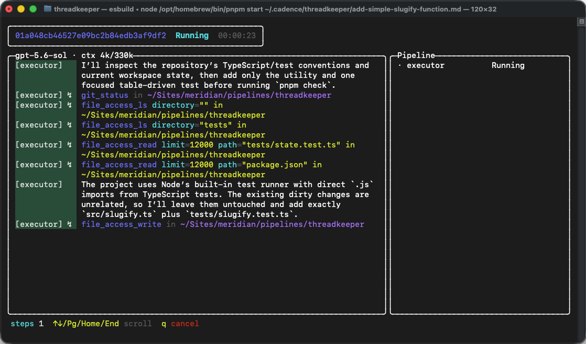

# Threadkeeper

A dead-simple coding loop on top of [Tandem](https://github.com/maxanstey-meridian/tandem), built to keep LLMs on track.



- One agent does the work and is forced to check in periodically with a second agent.
- The second agent reviews the work so far and corrects it when it starts drifting from the plan.
- A final reviewer either signs off the result or sends it back for correction.

Give Threadkeeper a Markdown plan and a workspace. It keeps going until the work is accepted, or a real blocker stops it.

```sh
pnpm install
pnpm start /absolute/path/to/plan.md
```

Use `skills/packet-authoring/SKILL.md` to get started.
